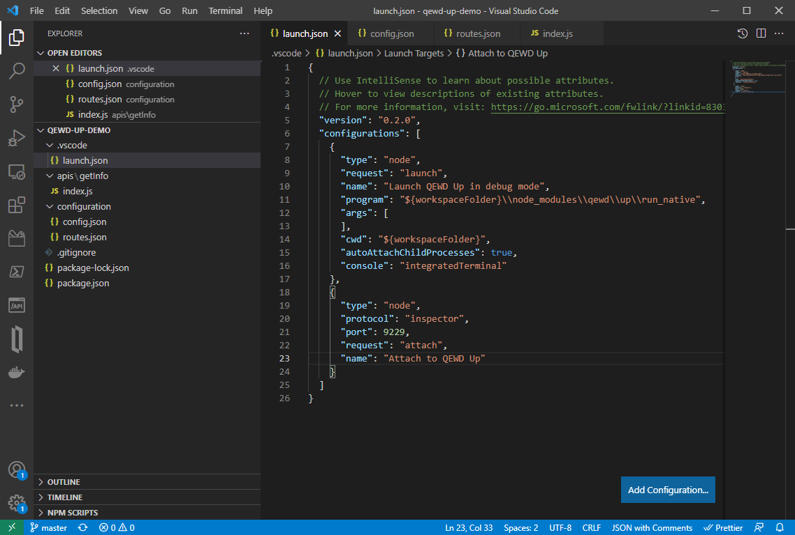

# Debugging your QEWD-Up server in Visual Studio Code (VSC)

## Debugging the QEWD-Up demo server repository

### QEWD-Up demo server setup

Open a new VSCode window, clone the [demo repository](https://github.com/wdbacker/qewd-up-demo) and open it:


Inside the directory you've chosen to clone the repository, issue in a command window:
```
# npm install
```
Open the `configuration/config.json` file and adjust the port and database connection settings to you own environment.

### Running and debugging the demo server inside VSCode

In VSCode you'll see this (I opened the most important files):



Set a breakpoint in the `/api/info` handler:


Now start debugging from the VSCode debug tab (start the `Launch QEWD Up in debug mode` config option):


Now issue a call to the `/api/info` endpoint in your browser:


You'll see the QEWD workers starting up, the debugger will attach to them and the code stops at your breakpoint:


Now you can inspect all variables, step through your code, ...

To end your debug session, press Ctrl+C in the terminal window at the bottom where QEWD logs its messages. *Don't use the debugger's stop button as it will only end your QEWD master process without properly ending the child workers!*

### Running the QEWD-Up demo server in a command window and debug it "remotely" using VSCode

In this case, we'll use the second debug launch configuration. First open a command window at the directory where the QEWD-Up server lives and start it in inspect mode:
```
# node --inspect node_modules/qewd/up/run_native
```
Now go to VSCode and start the `Attach to QEWD Up` debug config:


You'll see the debugger has attached in the command window too:


Try again to issue a call in your browser. You see QEWD-Up start its workers, the debugger attaches to them and the debugger will halt on your code breakpoint.

One thing you need to keep in mind in this debugging mode: you can't debug QEWD-Up's startup in this mode because it's already started before the debugger kicks in. When you want to debug the startup code too, use the other launch option. 

A powerful feature in this mode: you can debug a remote QEWD Up server by adding the `address` option in `launch.json`. See [remote debugging](https://code.visualstudio.com/docs/nodejs/nodejs-debugging#_remote-debugging) for this.

## Setting up your debugging environment

First, create a `.vscode/launch.json` file in your QEWD-Up project:

```javascript
{
  // Use IntelliSense to learn about possible attributes.
  // Hover to view descriptions of existing attributes.
  // For more information, visit: https://go.microsoft.com/fwlink/?linkid=830387
  "version": "0.2.0",
  "configurations": [
    {
      "type": "node",
      "request": "launch",
      "name": "Launch QEWD Up server in inspector mode",
      "program": "${workspaceFolder}\\node_modules\\qewd\\up\\run_native",
      "cwd": "${workspaceFolder}",
      "autoAttachChildProcesses": true,
      "console": "integratedTerminal"
    },
    {
      "type": "node",
      "protocol": "inspector",
      "port": 9229,
      "request": "attach",
      "name": "Attach to QEWD Up server"
    }
  ]
}
```
This ``launch.json`` file allows you to debug your server in two ways:
- start your QEWD-Up server within VSCode using VSCode's `integratedTerminal`
- start your QEWD-Up server as usual in an external console window using a debug option on the commandline

*In a Windows environment, there is one option that you must avoid: never use the default `"console": "internalConsole"` option. Because the VSCode debug console doesn't pass the Ctrl+C  (SIGINT) signal to the running master process, your QEWD-Up will not stop gracefully and leave all database connections open. Using `"console": "integratedTerminal"` is the way to go because you get a full PowerShell command window supporting SIGINT on pressing Ctrl+C to stop the server. Also never use the debugger's red square stop button, only use Ctrl+C in the PowerShell terminal inside VSCode!*

### Starting your QEWD-Up server within VSCode using VSCode's `integratedTerminal`

Steps:
- inside VSCode, go to the Debug tab
- start debugging using the `Launch QEWD Up server in inspector mode` settings
  
You can debug now your QEWD-Up server completely from the very beginning, including your handler code, request/response hooks, all startup modules like addMiddleware, ...

This debugging method is not suited however on a staging (or production) environment.

### Starting your QEWD-Up server in an external console window using a debug option on the commandline

Steps:
- open an external command window
- start your QEWD-Up server on the command line using:
  ```
  node --inspect node_modules/qewd/up/run_native
  ```
  the QEWD-Up server starts as usual but will listen for incoming debugging connections from VSCode on debug port 9229
- head over to your VSCode window and go to the Debug tab
- start debugging using the `Attach to QEWD-Up server` settings

You can debug your handler code now with breakpoints, step by step, ... using all features VSCode's Node debugger provides.

This debugging method is recommended for:
- debugging handlers and/or lifecycle hook functions
- debug a staging (or even production) server

To debug QEWD-Up server startup code however, this debug option is not suited (e.g. when debugging your addMiddleWare code).

### Debug an existing QEWD.js server

In case your server doesn't use the QEWD-Up structure already and you're using QEWD.js, you just need to change the `program` setting inside `launch.json` and point it to your own QEWD.js startup script (in most cases the modified `node_modules/qewd/example/qewd.js` startup file at the root folder of your QEWD.js server):

```javascript
{
  // Use IntelliSense to learn about possible attributes.
  // Hover to view descriptions of existing attributes.
  // For more information, visit: https://go.microsoft.com/fwlink/?linkid=830387
  "version": "0.2.0",
  "configurations": [
    {
      "type": "node",
      "request": "launch",
      "name": "Launch QEWD Up server in inspector mode",
      "program": "${workspaceFolder}\\qewd.js",
      "cwd": "${workspaceFolder}",
      "autoAttachChildProcesses": true,
      "console": "integratedTerminal"
    },
    {
      "type": "node",
      "protocol": "inspector",
      "port": 9229,
      "request": "attach",
      "name": "Attach to QEWD Up server"
    }
  ]
}
```