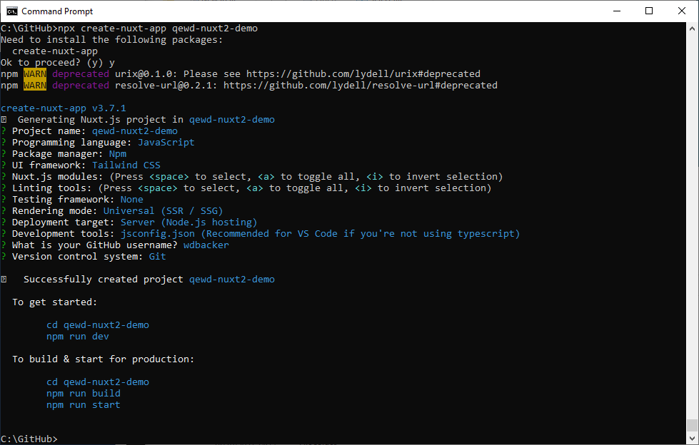
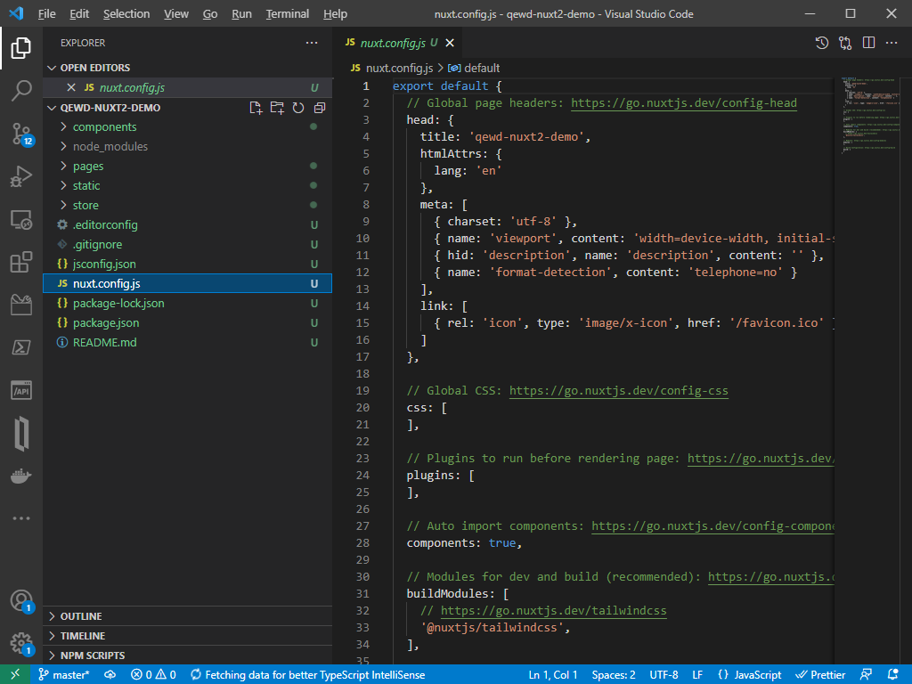

# NuxtJS 2 demo app with QEWD-Up

When you're writing a web app using QEWD-Up, you can use a lot of frontend technologies. One of the most approachable options is using NuxtJS and Vue.js. When you want to write a complete application with multiple pages and apps, NuxtJS is a great choice. It provides you with a complete environment for writing web apps.

For this tutorial, we will be using a basic [QEWD-Up demo server](QEWD-Up-demo.md). You'll need to have this demo server up & running first to use it as a back-end server for this demo application.

This tutorial is about integrating [NuxtJS 2](https://nuxtjs.org/) (using Vue.js 2) with your apps. For the latest [NuxtJS 3](https://v3.nuxtjs.org/) (currently in beta) and Vue.js 3, refer to the [NuxtJS 3 demo app](Nuxt3-demo.md)

## The fast path (TL;DR)

[Visual Studio Code (VSC)](https://code.visualstudio.com/download) is used to clone the [qewd-nuxt2-demo](https://github.com/wdbacker/qewd-nuxt2-demo) repository and run the demo

Steps:
- it is assumed your QEWD-Up server runs on the same host as this NuxtJS demo app
- inside a directory of your choice, open VSC
- clone the [qewd-nuxt2-demo](https://github.com/wdbacker/qewd-nuxt2-demo) repository using the Git clone command on the command palette: `https://github.com/wdbacker/qewd-nuxt2-demo.git`
- run the demo from VSC's debug tab (start the `NuxtJS fullstack` launch configuration)
- try the `Send` buttons to send requests to the QEWD-Up back-end
- tip: stop your running QEWD-Up server with Ctrl+C and watch what happens in your NuxtJS demo; restart QEWD-Up and look again at the NuxtJS demo: you'll see the front-end reconnecting to the back-end automagically

## The demo in more detail

- First, create a NuxtJS app skeleton inside a folder of your choice:
  ```
  # npx create-nuxt-app qewd-nuxt2-demo
  ```
  

- Install QEWD-Up client using npm:
  ```
  # npm install wdbacker/qewd-client
  ```
  *(you're using my fork of `qewd-client` due to a small module tweak needed for NuxtJS)*

- Open the project folder inside VSCode and open ``nuxt.config.js``:
  

  ```javascript
  export default {
    server: {
      host: '0.0.0.0'
    },
    // Global page headers: https://go.nuxtjs.dev/config-head
    head: {
      title: 'qewd-nuxt2-demo',
      htmlAttrs: {
        lang: 'en'
      },
      meta: [
        { charset: 'utf-8' },
        { name: 'viewport', content: 'width=device-width, initial-scale=1' },
        { hid: 'description', name: 'description', content: '' },
        { name: 'format-detection', content: 'telephone=no' }
      ],
      link: [
        { rel: 'icon', type: 'image/x-icon', href: '/favicon.ico' }
      ]
    },

    // Global CSS: https://go.nuxtjs.dev/config-css
    css: [
    ],

    // Plugins to run before rendering page: https://go.nuxtjs.dev/config-plugins
    plugins: [
      '~/plugins/qewd-nuxt2-plugin.client.js'
    ],

    publicRuntimeConfig: {
      qewdUrl: process.env.QEWD_URL || 'http://localhost:8080'
    },

    // Auto import components: https://go.nuxtjs.dev/config-components
    components: true,

    // Modules for dev and build (recommended): https://go.nuxtjs.dev/config-modules
    buildModules: [
      // https://go.nuxtjs.dev/tailwindcss
      '@nuxtjs/tailwindcss',
    ],

    // Modules: https://go.nuxtjs.dev/config-modules
    modules: [
      '@nuxt/http'
    ],

    // Build Configuration: https://go.nuxtjs.dev/config-build
    build: {
      extend(config, ctx) {
        if (ctx.isDev) {
          config.devtool = ctx.isClient ? 'source-map' : 'inline-source-map'
        }
      }
    }
  }

  ```
  Highlights:
  - `server.host`: allows you to connect to the demo app using your development machine's ip address (not only on localhost)
  - `plugins`: this is where you include the QEWD-Up plugin module (important: the ``qewd-client`` module is only used client side, hence the `.client.js` extension)
  - `publicRuntimeConfig.qewdUrl`: the QEWD-Up url for your environment (adjust this to your needs, can be passed in from a ``.env`` file or environment vars & there is a fallback to `localhost`)
  - if you want to test the app from a different device on your network (or your QEWD-Up server runs on another host), change `publicRuntimeConfig.qewdUrl` from `localhost` to the real ip address of the host running QEWD-Up
  - `buildModules`: the demo uses TailwindCSS css utility lib
  - `modules`: the demo uses the `@nuxt/http` module to issue REST requests to the QEWD-Up back-end
  - `build.extend(...)`: configure the WebPack devtool option to build sourcemaps for debugging (they work best inside Chrome Devtools)

- Open `plugins/qewd-nuxt2-plugin.client.js` in the plugins folder:
  ```javascript
  import { QEWD } from 'qewd-client'

  // anonymous function needed here, no arrow function!
  export default function({ app }, inject) {
    QEWD.on('ewd-registered', function() {
      QEWD.setCookie('qewdSession');
      // Your QEWD environment is ready, emit the ready event
      QEWD.emit('ready', {ready: true})
    })
    QEWD.on('ewd-reregistered', function() {
      QEWD.setCookie('qewdSession');
      // Your QEWD environment is ready, emit the ready event
      QEWD.emit('ready', {ready: true})
    })
    QEWD.on('socketDisconnected', function() {
      document.cookie = "qewdSession= ; expires = Thu, 01 Jan 1970 00:00:00 GMT"
      // Your QEWD environment isn't ready, emit the ready event
      QEWD.emit('ready', {ready: false})
    })
    // add request method wrapper preserving the Vue component this context
    function _request(messageObj) {
      return new Promise(function(resolve) {
        QEWD.send(messageObj, function(responseObj) {
          resolve(responseObj);
        })
      })
    }
    QEWD.request = _request.bind(app)
    // Inject $qewd in Vue, context and store.
    inject('qewd', QEWD)
  }
  ```
  Highlights:
  - ``{ QEWD }`` is imported from the ``qewd-client`` npm module
  - export a default function (no arrow function!) receiving the NuxtJS app context and inject method as parameters
  - the plugin registers three event handlers for QEWD-Up's WebSocket registration/disconnection: set or delete session cookie & emit a single ``ready`` event
  - define an additional `request` method for convenience, preserving the Vue.js ``this`` context by binding it to the NuxtJS app context
  - inject the QEWD module in the NuxtJS app context, this makes the QEWD client module available everywhere in your NuxtJS pages as ``this.$qewd`` (in line with other NuxtJS plugin modules like e.g. ``this.$http``)

- Open `layouts/default.vue`:
  ```javascript
  <template>
    <div>
      <div class="text-top">
        QEWD-Up NuxtJS 2 demo app
        <span v-if="!qewdReady" class="text-red"> (the QEWD-Up server is down!)</span>
      </div>
      <nuxt keep-alive />
    </div>
  </template>

  <script>
  import io from 'socket.io-client'

  export default {
    data () {
      return {
        qewdReady: false
      }
    },
    created() {
      if (process.client) {
        let self = this
        /*
          create an event handler invoked when QEWD's connection is registered/ready
        */
        this.$qewd.on('ready', function(data) {
          self.qewdReady = data.ready
        })
        
        this.$qewd.start({
          application: 'nuxtjs-test',
          io,
          url: this.$config.qewdUrl
        })
        
      }
    }
  }
  </script>

  <style>
  .text-top {
    padding:1em;
    text-align: center;
    font-weight: bold;
  }
  .text-red {
    color: red;
  }
  </style>
  ```
  Highlights:
  - in the ``template``, a demo title and a conditional ``span`` is added to show when the QEWD-Up WebSocket connection is (not) ready
  - the `nuxt` component is the slot where content from pages is included by NuxtJS
  - in the `script` tag, the `io` WebSocket client code is imported
  - in the `data` method, an object containing the qewdReady reactive property is instantiated
  - in the NuxtJS/Vue.js `created` lifetime hook, a check is done first to ensure this code runs only on the client side (NuxtJS runs this hook method twice: server & client-side)
  - a QEWD event listener is added for the ``ready`` event defined in the QEWD plugin code (note the `this.$qewd` syntax we injected in the plugin)
  - in this demo, the QEWD WebSocket is started here: note the ``qewdUrl`` config option coming from the ``nuxt.config.js`` file
  - at the bottom, a `style` tag adds some custom styling
  
- Open `pages/index.vue`:
  ```javascript
  <template>
    <Tutorial/>
  </template>
  ```
  The main starting page only instantiates the `Tutorial` Vue.js component

- Open `components/Tutorial.vue`:
  ```javascript
  <template>
    <div class="relative flex items-top justify-center min-h-screen bg-gray-100 sm:items-center sm:pt-0">
      <link href="https://cdn.jsdelivr.net/npm/tailwindcss@2.1.2/dist/tailwind.min.css" rel="stylesheet">
      <div class="max-w-4xl mx-auto sm:px-6 lg:px-8 min-w-full">
        ...
        <div>
          <div class="mt-4 bg-white overflow-hidden shadow sm:rounded-lg p-6">
            <h2 class="text-xl font-semibold">
              QEWD-Up response:
            </h2>
            <p class="mt-3 text-red-500 italic hover:underline">
              {{ response }}
            </p>
            <p class="mt-4 pt-4 text-gray-800 border-t border-dashed">
              <button class="bg-gray-900 text-gray-100 rounded hover:bg-gray-800 px-4 py-2 focus:outline-none" @click="sendWebSocketMessage">Send (WS)</button>
              <button class="bg-gray-900 text-gray-100 rounded hover:bg-gray-800 px-4 py-2 focus:outline-none" @click="sendRESTMessage">Send (REST)</button>
              <NuxtLink to="/page2" no-prefetch class="bg-gray-900 text-gray-100 rounded hover:bg-gray-800 px-4 py-2 float-right focus:outline-none">To page 2</NuxtLink>
            </p>
          </div>
        </div>
      </div>
    </div>
  </template>

  <script>
  export default {
    data () {
      return {
        response: 'Nothing sent yet!'
      }
    },
    methods: {
      sendWebSocketMessage() {
        /*
        let self = this
        this.$qewd.reply({
          type: 'test',
          params: {
            text: 'a NuxtJS WebSockets test message'
          }
        }).then(response => {
          self.response = response.message.text
        })
        */
        this.$qewd.request({
          type: 'test',
          params: {
            text: 'a NuxtJS WebSockets test message'
          }
        }).then(response => {
          this.response = response.message.text
        })
        
      },
      async sendRESTMessage() {
        try {
          const response = await this.$http.$get(`${this.$config.qewdUrl}/api/test?text=a+NuxtJS+REST+test+message`)
          this.response = response.text
        }
        catch(error) {
          this.response = 'Error sending REST message!'
        }
      }
    }
  }
  </script>
  ```
  Highlights:
  - `Tutorial` component consists of a QEWD response text and two buttons to send a test message to the QEWD-Up back-end, both using WebSockets messages and REST calls
  - a `NuxtLink` tag is a NuxtJS link to the second demo page
  - a reactive `response` property is defined in `data` for use in the template
  - the `sendWebSocketMessage` method sends a WebSocket request to QEWD-Up: note the difference in `this` context when using the `reply` vs `request` method
  - the *async* `sendRESTMessage` method sends a REST request to QEWD-Up using the NuxtJS `this.$http` module

- Open `pages/page2.vue`:
  ```javascript
  <template>
    ...
  </template>
  <script>
  export default {
    data () {
      return {
        response: 'Nothing sent yet!'
      }
    },
    methods: {
      sendWebSocketMessage() {
        ...
      },
      async sendRESTMessage() {
        ...
      }
    }
  }
  </script>
  ```
  Highlights:
  - the structure of page 2 is very analogous to the `Tutorial` component
  - the purpose of this page is an example of multipage apps using the same QEWD-Up WebSocket connection `this.$qewd` instance
  - because the QEWD-Up client instance lives in the Nuxt layout, the same QEWD-Up connection instance can be re-used after a page content switch
  
- check out `.vscode/launch.json`:
  ```json
  {
    // Use IntelliSense to learn about possible attributes.
    // Hover to view descriptions of existing attributes.
    // For more information, visit: https://go.microsoft.com/fwlink/?linkid=830387
    "version": "0.2.0",
    "configurations": [
      {
        "type": "pwa-chrome",
        "request": "launch",
        "name": "Chrome client",
        "url": "http://localhost:3000",
        "webRoot": "${workspaceFolder}"
      },
      {
        "type": "pwa-node",
        "request": "launch",
        "name": "NuxtJS server",
        "args": ["dev"],
        "osx": {
          "program": "${workspaceFolder}/node_modules/.bin/nuxt"
        },
        "linux": {
          "program": "${workspaceFolder}/node_modules/.bin/nuxt"
        },
        "windows": {
          "program": "${workspaceFolder}/node_modules/nuxt/bin/nuxt.js"
        },
        "console": "integratedTerminal"
      }
    ],
    "compounds": [
      {
        "name": "NuxtJS fullstack",
        "configurations": ["NuxtJS server", "Chrome client"]
      }
    ]
  }
  ```
  Highlights:
  - this VSC config file contains configurations for lanching and debugging your app
  - there are two launch configurations: one for Chrome (front-end) and the other for the NuxtJS server (back-end)
  - ``Chrome client`` is just launching the front-end (best option is to debug your app in Chrome Devtools)
  - ``NuxtJS server`` is launching in development mode using Node.js
  - ``NuxtJS fullstack`` allows you to launch both configurations in one click
  - your app consists of *three moving parts*:
    - a Vue.js app front-end running your client app in Chrome
    - a Nuxt.JS app back-end running your server side code in Node.js
    - QEWD-Up provides the database back-end in Node.js
    - multiple deployment options (e.g. cloud too) are possible: NuxtJS abstracts all this, you don't need to care about all boilerplate!