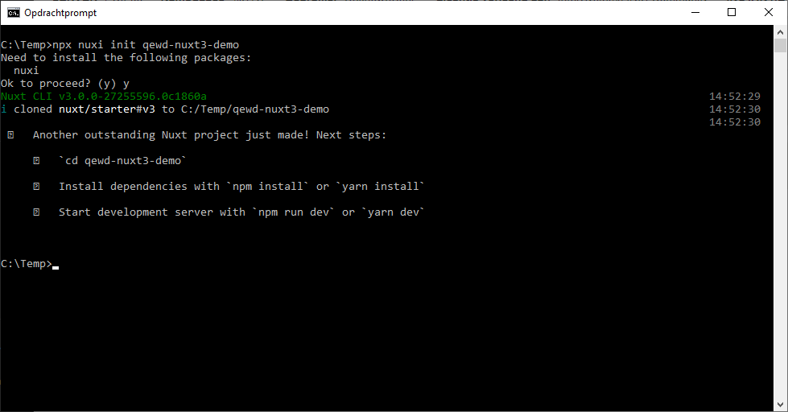
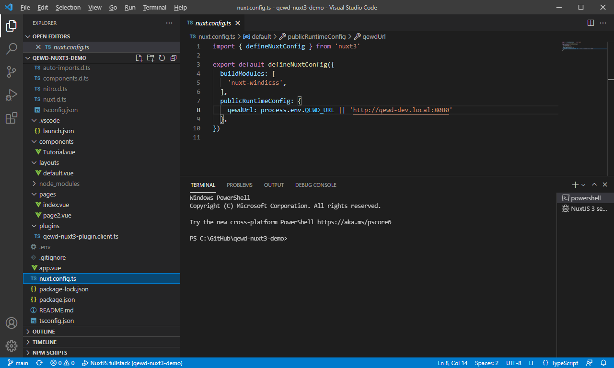

# NuxtJS 3 demo app with QEWD-Up

When you're writing a web app using QEWD-Up, you can use a lot of frontend technologies. One of the most approachable options is using NuxtJS and Vue.js. When you want to write a complete application with multiple pages and apps, NuxtJS is a great choice. It provides you with a complete environment for writing web apps. 

For this tutorial, we will be using a basic [QEWD-Up demo server](QEWD-Up-demo.md). You'll need to have this demo server up & running first to use it as a back-end server for this demo application.

This tutorial is about integrating [NuxtJS 3](https://v3.nuxtjs.org/) (using Vue.js 3) with your QEWD-Up apps. For [NuxtJS 2](https://nuxtjs.org/) (using Vue.js 2), refer to the [NuxtJS 2 demo app](Nuxt2-demo.md)

## The fast path (TL;DR)

[Visual Studio Code (VSC)](https://code.visualstudio.com/download) is used to clone the [qewd-nuxt3-demo](https://github.com/wdbacker/qewd-nuxt3-demo) repository and run the demo

Steps:
- it is assumed your QEWD-Up server runs on the same host as this NuxtJS demo app
- inside a directory of your choice, open VSC
- clone the [qewd-nuxt3-demo](https://github.com/wdbacker/qewd-nuxt3-demo) repository using the Git clone command on the command palette: `https://github.com/wdbacker/qewd-nuxt3-demo.git`
- run the demo from VSC's debug tab (start the `NuxtJS fullstack` launch configuration)
- try the `Send` buttons to send requests to the QEWD-Up back-end
- tip: stop your running QEWD-Up server with Ctrl+C and watch what happens in your NuxtJS demo; restart QEWD-Up and look again at the NuxtJS demo: you'll see the front-end reconnecting to the back-end automagically

## The demo in more detail

- First, create a NuxtJS app skeleton inside a folder of your choice:
  ```
  # npx nuxi init qewd-nuxt3-demo
  ```
  
  Follow the instructions and issue:
  ```
  # npm install
  # npm install nuxt-windicss -D
  ```

- Install QEWD-Up client using npm:
  ```
  # npm install qewd-client
  ```

- Open the project folder inside VSCode and open ``nuxt.config.ts``:
  
  ```javascript
  import { defineNuxtConfig } from 'nuxt3'

  export default defineNuxtConfig({
    buildModules: [
      'nuxt-windicss',
    ],
    publicRuntimeConfig: {
      qewdUrl: process.env.QEWD_URL || 'http://localhost:8080'
    },
  })

  ```
  Highlights:
  - `buildModules`: the demo uses Windi CSS css utility lib (an on-demand alternative for Tailwind CSS)
  - `publicRuntimeConfig.qewdUrl`: the QEWD-Up url for your environment (adjust this to your needs, can be passed in from a ``.env`` file or environment vars & there is a fallback to `localhost`)
  - if you want to test the app from a different device on your network (or your QEWD-Up server runs on another host), change `publicRuntimeConfig.qewdUrl` from `localhost` to the real ip address of the host running QEWD-Up

- Open `tsconfig.json`:
  ```json
  {
    "extends": "./.nuxt/tsconfig.json",
    "compilerOptions": {
      "types": [
        "nuxt-windicss"
      ]
    }
  }
  ```
  This adds the Windi CSS TypeScript types for convenience in VSC

- Add the plugins folder at the root of your project and create the `plugins/qewd-nuxt3-plugin.client.ts` file & open it
- Inside the `qewd-nuxt3-plugin.client.ts` file, add the following code:
  ```javascript
  import { defineNuxtPlugin } from '#app'
  import { QEWD } from 'qewd-client'

  // anonymous function needed here, no arrow function!
  export default defineNuxtPlugin(function(nuxtApp) {
    QEWD.on('ewd-registered', function() {
      QEWD.setCookie('qewdSession');
      // Your QEWD environment is ready, emit the ready event
      QEWD.emit('ready', {ready: true})
    })
    QEWD.on('ewd-reregistered', function() {
      QEWD.setCookie('qewdSession');
      // Your QEWD environment is ready, emit the ready event
      QEWD.emit('ready', {ready: true})
    })
    QEWD.on('socketDisconnected', function() {
      document.cookie = "qewdSession= ; expires = Thu, 01 Jan 1970 00:00:00 GMT"
      // Your QEWD environment isn't ready, emit the ready event
      QEWD.emit('ready', {ready: false})
    })

    // add request method preserving the Vue component this context
    function _request(messageObj: object) {
      return new Promise(function(resolve) {
        QEWD.send(messageObj, function(responseObj: object) {
          resolve(responseObj);
        })
      })
    }
    QEWD.request = _request.bind(nuxtApp)
  
    // Inject $qewd in Vue, context and store.
    nuxtApp.provide('qewd', QEWD)
  })

  declare module '#app' {
    interface NuxtApp {
      $qewd (): object
    }
  }
  ```
  Highlights:
  - ``{ QEWD }`` is imported from the ``qewd-client`` npm module
  - export a default function (no arrow function!) as parameters to `defineNuxtPlugin` receiving the NuxtJS app context as parameter
  - the plugin registers three event handlers for QEWD-Up's WebSocket registration/disconnection: set or delete session cookie & emit a single ``ready`` event
  - define an additional `request` method for convenience, preserving the Vue.js ``this`` context by binding it to the NuxtJS app context
  - inject the QEWD module in the NuxtJS app context using it's `provide` method, this makes the QEWD client module available everywhere in your NuxtJS pages as ``this.$qewd`` (in line with other NuxtJS plugin modules like e.g. ``this.$fetch``)
  - declare a TypeScript type for $qewd

- Open `app.vue`:
  ```javascript
  <template>
    <div>
      <NuxtPage />
    </div>
  </template>
  ```
  Highlights:
  - `app.vue` is the main entry point of the app
  - in the `template` component, the `NuxtPage` component is the placeholder for all your app's pages
  - in NuxtJS 3, this `app.vue` file now also allows you to create single page apps using NuxtJS (the page router is not included in that case)

- Open `layouts/default.vue`:
  ```javascript
  <template>
    <div>
      <div class="text-top">
        QEWD-Up NuxtJS 3 demo app
        <span v-if="!qewdReady" class="text-red"> (the QEWD-Up server is down!)</span>
      </div>
      <slot />
    </div>
  </template>

  <script>
  import io from 'socket.io-client'

  export default {
    data () {
      return {
        qewdReady: false
      }
    },
    created() {
      if (process.client) {
        let self = this
        /*
          create an event handler invoked when QEWD's connection is registered/ready
        */
        this.$qewd.on('ready', function(data) {
          self.qewdReady = data.ready
        })
        
        this.$qewd.start({
          application: 'nuxtjs-test',
          io,
          url: this.$config.qewdUrl
        })
        
      }
    }
  }
  </script>

  <style scoped>
  .text-top {
    padding:1em;
    text-align: center;
    font-weight: bold;
  }
  .text-red {
    color: red;
  }
  </style>
  ```
  Highlights:
  - in the ``template``, a demo title and a conditional ``span`` is added to show when the QEWD-Up WebSocket connection is (not) ready
  - the `slot` component is the slot where content from pages is included by NuxtJS
  - in the `script` tag, the `io` WebSocket client code is imported
  - in the `data` method, an object containing the qewdReady reactive property is instantiated
  - in the NuxtJS/Vue.js `created` lifetime hook, a check is done first to ensure this code runs only on the client side (NuxtJS runs this hook method twice: server & client-side)
  - a QEWD event listener is added for the ``ready`` event defined in the QEWD plugin code (note the `this.$qewd` syntax we injected in the plugin)
  - in this demo, the QEWD WebSocket is started here: note the ``qewdUrl`` config option coming from the ``nuxt.config.ts`` file
  - at the bottom, a `style` tag adds some custom styling
  
- Open `pages/index.vue`:
  ```javascript
  <template>
    <Tutorial/>
  </template>
  ```
  The main starting page only instantiates the `Tutorial` Vue.js component

- Open `components/Tutorial.vue`:
  ```javascript
  <template>
    <div class="relative flex items-top justify-center min-h-screen bg-gray-100 sm:items-center sm:pt-0">
      <div class="max-w-4xl mx-auto sm:px-6 lg:px-8 min-w-full">
        ...
        <div>
          <div class="mt-4 bg-white overflow-hidden shadow sm:rounded-lg p-6">
            <h2 class="text-xl font-semibold">
              QEWD-Up response:
            </h2>
            <p class="mt-3 text-red-500 italic hover:underline">
              {{ response }}
            </p>
            <p class="mt-4 pt-4 text-gray-800 border-t border-dashed">
              <button class="bg-gray-900 text-gray-100 rounded hover:bg-gray-800 px-4 py-2 focus:outline-none" @click="sendWebSocketMessage">Send (WS)</button>
              <button class="bg-gray-900 text-gray-100 rounded hover:bg-gray-800 px-4 py-2 focus:outline-none ml-2" @click="sendRESTMessage">Send (REST)</button>
              <NuxtLink to="/page2" no-prefetch class="bg-gray-900 text-gray-100 rounded hover:bg-gray-800 px-4 py-2 float-right focus:outline-none">To page 2</NuxtLink>
            </p>
          </div>
        </div>
      </div>
    </div>
  </template>

  <script>
  export default {
    data () {
      return {
        response: 'Nothing sent yet!'
      }
    },
    methods: {
      sendWebSocketMessage() {
        /*
        let self = this
        this.$qewd.reply({
          type: 'test',
          params: {
            text: 'a NuxtJS WebSockets test message'
          }
        }).then(response => {
          self.response = response.message.text
        })
        */
        this.$qewd.request({
          type: 'test',
          params: {
            text: 'a NuxtJS WebSockets test message'
          }
        }).then(response => {
          this.response = response.message.text
        })
        
      },
      async sendRESTMessage() {
        try {
          const response = await $fetch(`${this.$config.qewdUrl}/api/test?text=a+NuxtJS+REST+test+message`)
          this.response = response.text
        }
        catch(error) {
          this.response = 'Error sending REST message!'
        }
      }
    }
  }
  </script>
  ```
  Highlights:
  - `Tutorial` component consists of a QEWD response text and two buttons to send a test message to the QEWD-Up back-end, both using WebSockets messages and REST calls
  - a `NuxtLink` tag is a NuxtJS link to the second demo page
  - a reactive `response` property is defined in `data` for use in the template
  - the `sendWebSocketMessage` method sends a WebSocket request to QEWD-Up: note the difference in `this` context when using the `reply` vs `request` method
  - the *async* `sendRESTMessage` method sends a REST request to QEWD-Up using the built-in NuxtJS `$fetch` method

- Open `pages/page2.vue`:
  ```javascript
  <template>
    ...
  </template>
  <script>
  export default {
    data () {
      ...
    },
    methods: {
      sendWebSocketMessage() {
        ...
      },
      async sendRESTMessage() {
        ...
      }
    }
  }
  </script>
  ```
  Highlights:
  - the structure of page 2 is very analogous to the `Tutorial` component
  - the purpose of this page is an example of multipage apps using the same QEWD-Up WebSocket connection `this.$qewd` instance
  - because the QEWD-Up client instance lives in the Nuxt layout, the same QEWD-Up connection instance can be re-used after a page content switch
  
- check out `.vscode/launch.json`:
  ```json
  {
    // Use IntelliSense to learn about possible attributes.
    // Hover to view descriptions of existing attributes.
    // For more information, visit: https://go.microsoft.com/fwlink/?linkid=830387
    "version": "0.2.0",
    "configurations": [
      {
        "type": "pwa-chrome",
        "request": "launch",
        "name": "Chrome client",
        "url": "http://localhost:3000",
        "webRoot": "${workspaceFolder}"
      },
      {
        "type": "pwa-node",
        "request": "launch",
        "name": "NuxtJS 3 server",
        "args": ["dev"],
        "osx": {
          "program": "${workspaceFolder}/node_modules/.bin/nuxt3"
        },
        "linux": {
          "program": "${workspaceFolder}/node_modules/.bin/nuxt3"
        },
        "windows": {
          "program": "${workspaceFolder}/node_modules/nuxt3/bin/nuxt.mjs"
        },
        "console": "integratedTerminal"
      }
    ],
    "compounds": [
      {
        "name": "NuxtJS fullstack",
        "configurations": ["NuxtJS 3 server", "Chrome client"]
      }
    ]
  }
  ```
  Highlights:
  - this VSC config file contains configurations for lanching and debugging your app
  - there are two launch configurations: one for Chrome (front-end) and the other for the NuxtJS server (back-end)
  - ``Chrome client`` is just launching the front-end (best option is to debug your app in Chrome Devtools)
  - ``NuxtJS 3 server`` is launching in development mode using Node.js
  - ``NuxtJS fullstack`` allows you to launch both configurations in one click
  - your app consists of *three moving parts*:
    - a Vue.js app front-end running your client app in Chrome
    - a Nuxt.JS app back-end running your server side code in Node.js
    - QEWD-Up provides the database back-end in Node.js
    - multiple deployment options (e.g. cloud too) are possible: NuxtJS abstracts all this, you don't need to care about all boilerplate!

If you compare the code structure in NuxtJS 3, you'll notice that it has full TypeScript support (avoiding errors in development). Btw, TypeScript is not a requirement: you can use it as you go!

Compared to NuxtJS 2, there is even less boilerplate code and the best part of it: the development server is *lightning* fast because it uses [Vite](https://vitejs.dev/), a universal tool used by many of the popular frameworks.